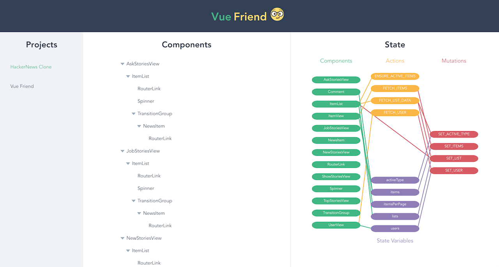

> Vue.js developer assistant that visualizes your project source code



## :construction: Under development

Release date uncertain (part-time development began on November 23)

## :white_check_mark: To-do list

#### Improve Projects pane

- [ ] Enable user to add projects

#### Improve Components pane

- [ ] Show more details about each component

#### Improve State pane

- [ ] Enable user to select things, which filters to show causally-linked things

#### Analyze projects

- [ ] Figure out a good way to parse a project's Vue component tree
- [ ] Figure out a good way to parse a project's Vuex store

## :notebook: How to use

``` bash
# install dependencies with Yarn (yarnpkg.com)
yarn

# serve with hot reload at localhost:8080
npm run dev

# build for production with minification
npm run build

# run unit tests
npm run unit

# run e2e tests
npm run e2e

# run all tests
npm test
```

For detailed explanation on how things work, checkout the [guide](http://vuejs-templates.github.io/webpack/) and [docs for vue-loader](http://vuejs.github.io/vue-loader).
